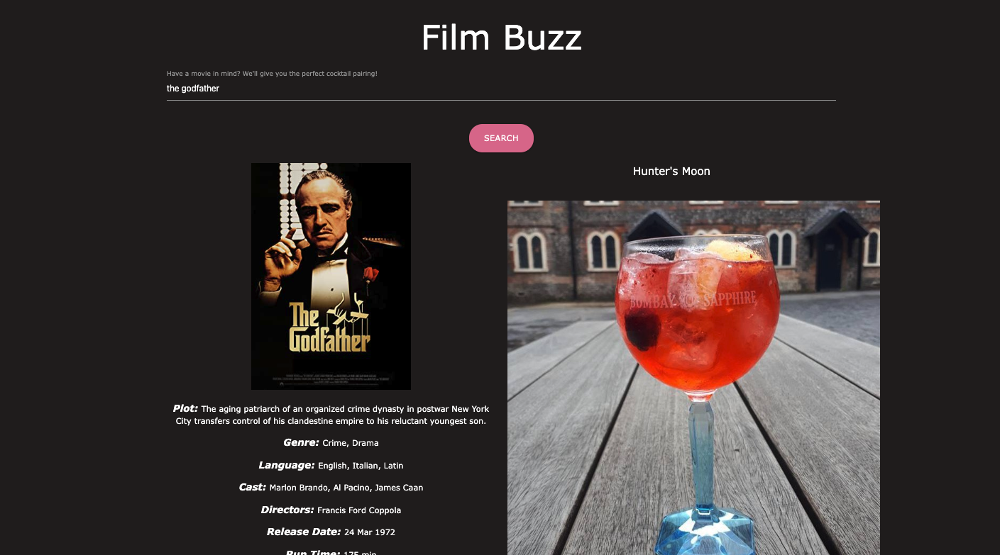
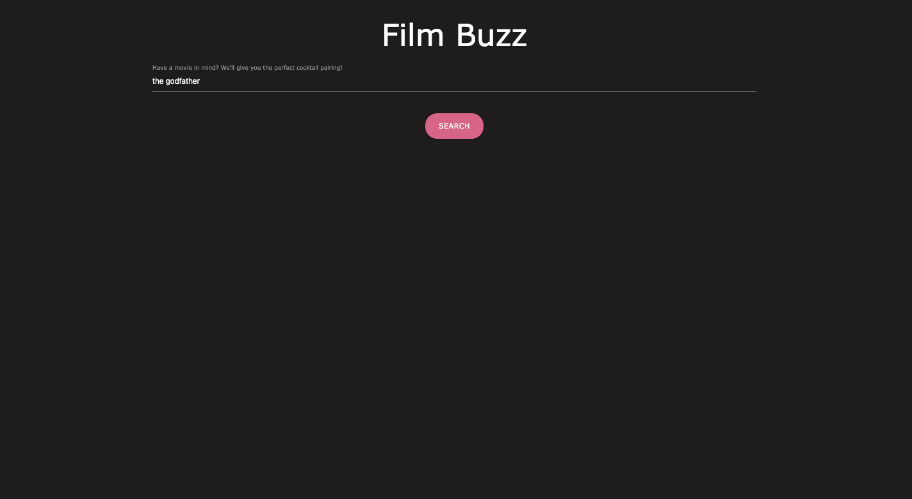
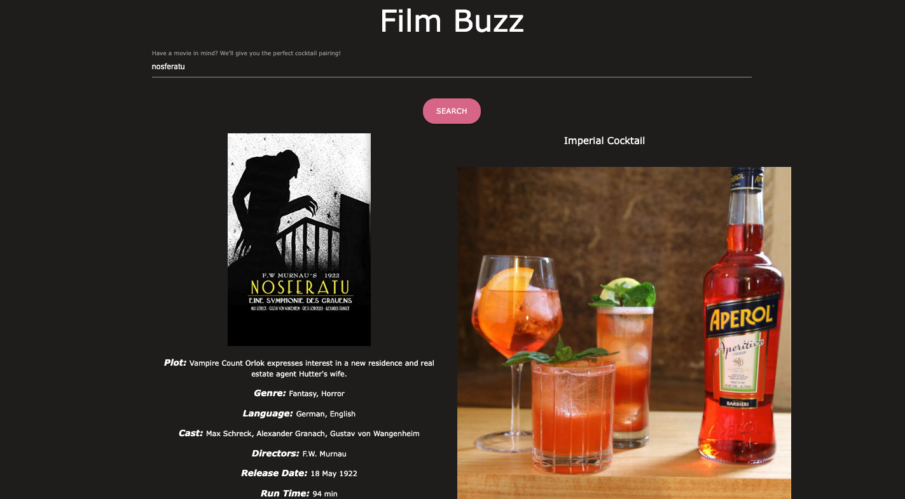

# Film-Buzz

## Description

The goal of this project was to create a user-friendly website that would pair a desired movie selection with an alcoholic beverage. The user is encouraged to type in a movie title. Upon clicking the submit button, an appropriate cocktail pairing is suggested based on the genre(s) of the movie. In short, our team created this website as a fun service for users looking for a night of entertainment. In order to accomplish this, the team used two APIs (OMDb and thecocktaildb), fetch functions, local storage, if/else statements, and various other functions and event listeners. In addition to learning the ins and outs of the aforementioned skills, the most important practice we learned was the use of GitHub. That mostly consisted of many push/pull requests, creating team-member-assigned issues, and updating the Projects tab. Furthermore, we gained an understanding of resolving conflicts, although we are proud to say those were minimal.

## Credits

Third party APIs:

https://www.omdbapi.com/
https://www.thecocktaildb.com/api.php

## Technology Used:

1. HTML
2. CSS
3. JavaScript

## Active Link: https://katarinamihaylovich.github.io/film-buzz/

## Screenshots 
(in various states of use)

